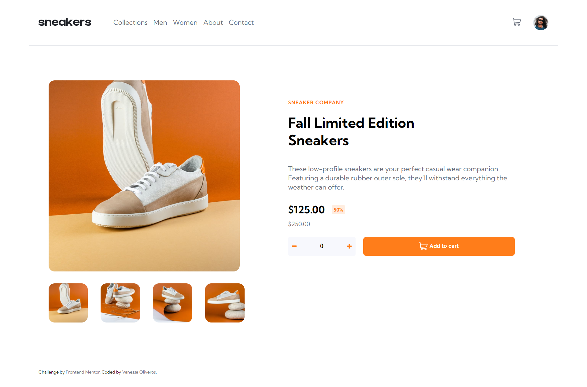
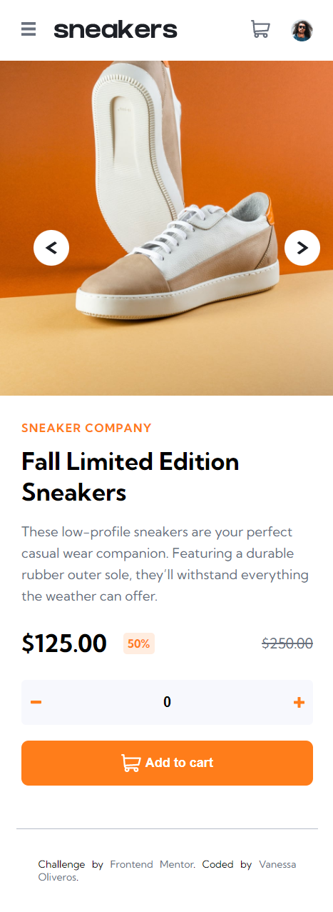

# Frontend Mentor - E-commerce product page solution

This is a solution to the [E-commerce product page challenge on Frontend Mentor](https://www.frontendmentor.io/challenges/ecommerce-product-page-UPsZ9MJp6). Frontend Mentor challenges help you improve your coding skills by building realistic projects.

## Table of contents

- [Overview](#overview)
  - [The challenge](#the-challenge)
  - [Screenshot](#screenshot)
  - [Links](#links)
- [My process](#my-process)
  - [Built with](#built-with)
- [Getting Started](#getting-started)
- [Author](#author)
- [Contributing](#contributing)
- [Show your support](#show-your-support)
- [Acknowledgments](#acknowledgments) 
- [License](#license)

## Overview

### The challenge

Users should be able to:

- View the optimal layout for the site depending on their device's screen size
- See hover states for all interactive elements on the page
- Open a lightbox gallery by clicking on the large product image
- Switch the large product image by clicking on the small thumbnail images
- Add items to the cart
- View the cart and remove items from it

### Screenshot

### Links

- Solution URL: [Add solution URL here](https://your-solution-url.com)
- Live Site URL: [Add live site URL here](https://vvoo21.github.io/Ecommerce/dist)

## My process

### Built with

- HTML/CSS & JavaScript best practices: Correct use of tags, elements, properties and syntax.
- Mobile-first workflow
- Linters Check: Local and Pull Request check for errors, bugs and stylistic errors in code.
- Gitflow
- Webpack 5

## Getting Started

To get a local copy up and running follow these simple example steps:

- git clone `https://github.com/vvoo21/Ecommerce.git`
- To navigate into the project directory, use "cd Leaderboard/"
- npm install
- npm start

and enjoy

## Author

👤 **Vanessa Oliveros Padron**

- GitHub: [@vvoo21](https://github.com/vvoo21)
- Twitter: [@vaneoliverosp](https://twitter.com/vaneoliverosp)
- LinkedIn: [vaneoliverosp](https://www.linkedin.com/in/vaneoliverosp/)

## 🤝 Contributing

Contributions, issues, and feature requests are welcome!

Feel free to check the [issues page](../../issues/).

## Show your support

Give a ⭐️ if you like this project!

## Acknowledgments

- Hat tip to anyone whose code was used
- Hat tip to The Microverse Program!

## 📝 License

This project is [MIT](./LICENSE) licensed.

_NOTE: we recommend using the [MIT license](https://choosealicense.com/licenses/mit/) - you can set it up quickly by [using templates available on GitHub](https://docs.github.com/en/communities/setting-up-your-project-for-healthy-contributions/adding-a-license-to-a-repository). You can also use [any other license](https://choosealicense.com/licenses/) if you wish._
